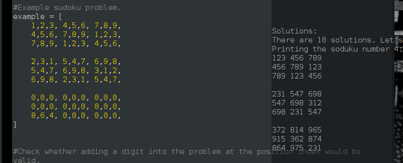

# Sudoku-Solver
Python script for completely solving sudokus using backtracking. Here is an example: 

Let the 81 fields be filled with digits 0,1...8,9. The trivial digit 0 denotes an empty field. At each step of the algorithm we can easily test whether the sudoku is still valid, so whether there are repeated digits in some row, column or block. 

Caveat!
Note that a soduku can be valid but still have no solution! Just look at this one. It is perfectly valid but not solvable. 

    1 2 0  4 5 6  7 8 9 
    0 0 3  0 0 0  0 0 0 
    0 0 0  0 0 0  0 0 0 

    0 0 0  0 0 0  0 0 0 
    0 0 0  0 0 0  0 0 0 
    0 0 0  0 0 0  0 0 0 

    0 0 0  0 0 0  0 0 0 
    0 0 0  0 0 0  0 0 0 
    0 0 0  0 0 0  0 0 0

The algorithm uses a principal called backtracking. Let us explain how it works in a nutshell:
- The algorithm will iterate over the not filled-in fields incrementing the last filled-in field.
- Check whether the sudoku is still valid.
  - If it is then keep going, move to the next field and add one to its value. In particular the next field is going to be empty so set it to one and repeat the algorithm with a different field as last filled-in field.
  - If it is not then the last filled-in field has to be incremented again. This happens until we either reach some valid digit or we reach an over-flow. In case of an over-flow we go back. Revert the last filled-in field to its default value, so empty it out and then repeat the algorithm using the second last filled-in field as new last field-in field.     
- The algorithm will continue until either the alphabetically lowest solution is found or the sudoku tries to empty some field that is already empty. This terminates the algorithm but also tells us whether there are any solutions of higher alphabetical order.

Now assume we have some sudoku given. The given digits can not be changed, only the empty fields. We will use a large loop in each iteration use the backtracking algorithm to search the alphabetically next solution and adding it to a list. As soon as we reached the empty sudoku (so every field that was not given is empty) the list of all solutions is finished we just have to output it. 

This is not an optimal algorithm for any sudoku but it is easy to implement and will solve most sudokus in a few minutes. Note that it is faster the more entries the sudoku has. What might also be interesting is that this algorithm can easily be implemented with abitrary sizes, it doesn't have to be a $3 \times 3 \times 3$ field. However it has to be the multiplication table of a group of size $n^p$.
